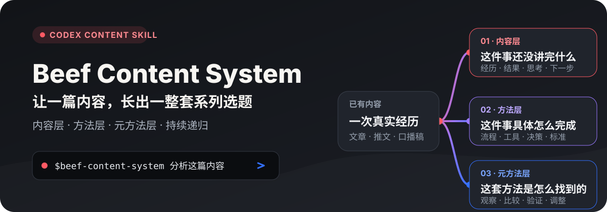
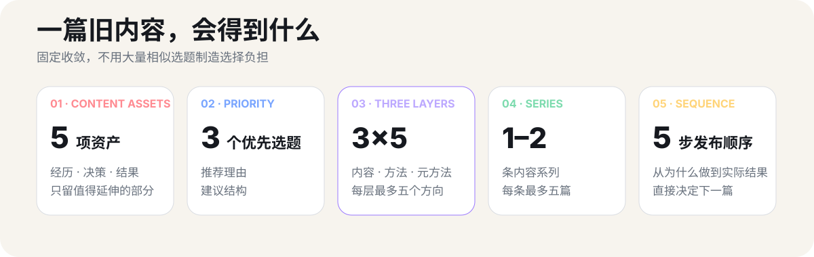
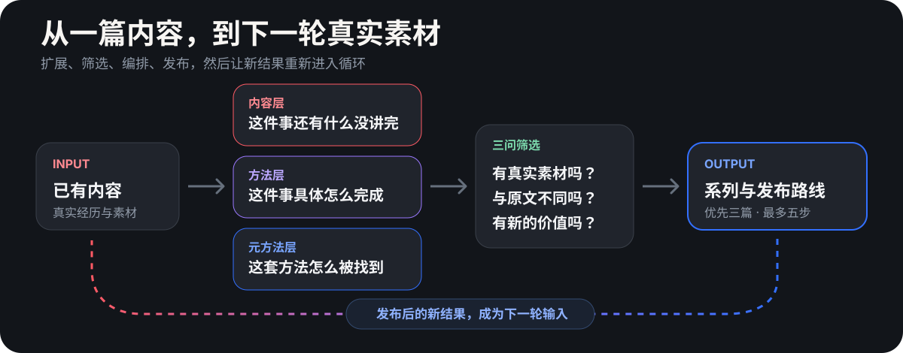

<p align="center">
  
</p>

<p align="center">
  <a href="https://beefapi.com/">
    
  </a>
</p>

**Beef Content System** 是一个面向内容创作者的 Codex Skill。给它一篇已经写过的文章、推文、口播稿或笔记，它会从真实素材中继续延伸，帮你找到下一篇、下一组系列，以及内容发布后的下一轮方向。

它不从零制造灵感，也不靠更换标题增加数量。所有选题都必须通过三个问题：**有真实素材吗？与原文真的不同吗？能给读者带来新价值吗？**

## 一篇内容，会得到什么

<p align="center">
  
</p>

- 提取最多 **5 项**真正值得继续使用的内容资产。
- 推荐 **3 个**最值得先写的选题，并提供推荐理由与建议结构。
- 从**内容、方法、元方法**三层继续延伸，每层最多保留 5 个方向。
- 编排 **1–2 条**内容系列，每条最多 5 篇。
- 收敛为最多 **5 步**的建议发布顺序。

查看真实示例：[从一篇小红书起号推文，延伸出三层选题与两条内容系列](./references/output-example.md)。

## 三层递归，不是换标题

<p align="center">
  
</p>

### 内容层

这件事本身还有什么没有讲完：做了什么、为什么做、得到什么结果、有什么思考，以及下一步做什么。

### 方法层

这件事具体是怎么完成的：完整流程、工具分工、关键决策、判断标准和重要环节。

### 元方法层

这套方法是怎么被找到的：观察了什么、比较了什么、怎样发现规律、如何验证，以及后来怎样调整。

> 方法告诉别人“怎么做”；元方法告诉别人“你是怎么找到这套做法的”。

## 最快开始

### 在 Codex 中安装

把下面这句话发给 Codex：

```text
帮我安装这个 skill：
https://github.com/glanderness/Beef-Content-System
```

也可以手动安装：

```bash
git clone https://github.com/glanderness/Beef-Content-System.git \
  ~/.codex/skills/beef-content-system
```

### 使用

```text
使用 $beef-content-system 分析下面这篇已有内容，
生成三个优先选题、三层延伸方向和精简发布路线：

[粘贴已有文章、推文、口播稿或笔记]
```

可选补充目标读者、发布平台，以及原文没有写进去的真实经历、过程或结果。

## 固定输出

```text
一、可以继续利用的内容资产
二、最值得先写的三个选题
三、按照三层框架继续延伸
四、可以形成的内容系列
五、建议发布顺序
```

优先选题只保留两项真正影响决策的信息：

- **推荐理由**：为什么这篇值得先写。
- **建议结构**：怎样把它讲清楚。

## 它适合什么内容

- 已经发布过、但仍有很多细节没讲完的推文或文章。
- 做完一个项目后积累的经历、过程、决策和结果。
- 可以继续拆成教程、复盘或系列内容的口播稿。
- 已经形成方法，希望进一步讲清方法来源的创作素材。
- 发布后获得新结果，希望继续进入下一轮的内容。

如果用户没有提供任何已有内容或真实经历，这个 Skill 不会凭空补齐事实。

## 设计原则

- **真实优先**：只使用用户拥有的经历、过程、决策与结果。
- **差异优先**：回答同一个问题的选题主动合并。
- **价值优先**：宁可少于上限，也不使用相似选题填满数量。
- **执行优先**：先推荐用户现在就有素材写出的内容。
- **持续生长**：发布后的结果与反馈，继续成为下一轮输入。

## 项目结构

```text
Beef-Content-System/
├── SKILL.md
├── agents/
│   └── openai.yaml
└── references/
    ├── topic-axes.md
    ├── scoring-rubric.md
    └── output-example.md
```

- [`SKILL.md`](./SKILL.md)：核心工作流、固定输出和质量约束。
- [`topic-axes.md`](./references/topic-axes.md)：内容、方法、元方法三层框架。
- [`scoring-rubric.md`](./references/scoring-rubric.md)：三问筛选与数量上限。
- [`output-example.md`](./references/output-example.md)：一份完整输出示例。

## 作者与交流

如果你对这个 Skill、AI 自媒体或内容工作流感兴趣，可以通过企业微信交流。

<p align="center">
  
</p>
